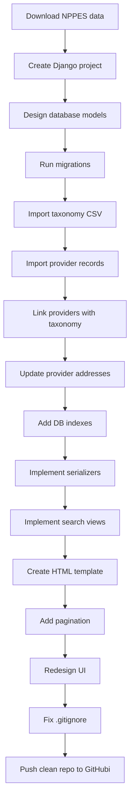

```mermaid
flowchart TD

A[Download NPPES data] --> B[Create Django project]
B --> C[Design database models]
C --> D[Run migrations]

D --> E[Import taxonomy CSV]
E --> F[Import provider records]
F --> G[Link providers with taxonomy]

G --> H[Update provider addresses]
H --> I[Add DB indexes]

I --> J[Implement serializers]
J --> K[Implement search views]

K --> L[Create HTML template]
L --> M[Add pagination]

M --> N[Redesign UI]
N --> O[Fix .gitignore]

O --> P[Push clean repo to GitHubi]
```
